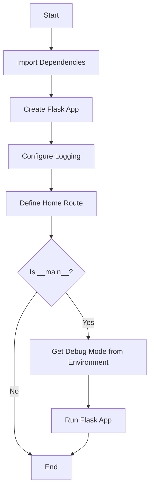
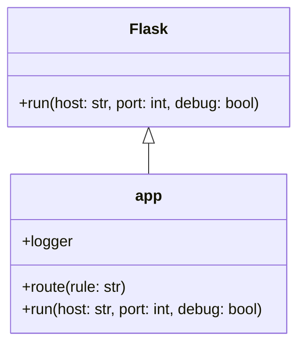
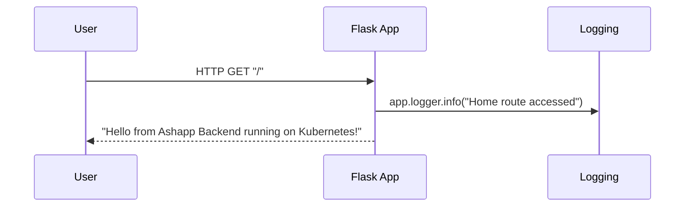

# System Design

Based on the provided `app.py` file, I can generate a simple Mermaid diagram representing the structure and flow of the Flask application. Here's the diagram in markdown fenced code block format:

This diagram illustrates the following flow from the `app.py` file:

1. The application starts
2. Dependencies are imported (logging, Flask, os)
3. A Flask app instance is created
4. Logging is configured
5. The home route ("/") is defined
6. The script checks if it's being run as the main program
7. If it is the main program, it gets the debug mode from the environment variable
8. The Flask app is run with specified host, port, and debug settings
9. If it's not the main program, or after running, the process ends

The diagram shows the basic structure and execution flow of the Flask application as defined in the `app.py` file.

# UML Diagrams

Based on the provided app.py file, I can generate a simple class diagram and a sequence diagram using Mermaid markdown format. Note that this is a very basic Flask application, so the diagrams will be relatively simple.

Class Diagram:

Sequence Diagram:

Explanation:

1. Class Diagram:
   - The class diagram shows the relationship between the Flask class and the 'app' instance created in app.py.
   - The Flask class is the parent class, and 'app' inherits from it.
   - The 'app' class has methods like route() and run(), as well as a logger attribute.

2. Sequence Diagram:
   - The sequence diagram illustrates the flow when a user accesses the root route ("/").
   - The user sends a GET request to the Flask app.
   - The app logs the access using the logger.
   - The app then responds with the greeting message.

These diagrams are based solely on the content of the app.py file. The application is quite simple, with only one route and basic logging functionality. The main components are the Flask application instance, the route handler, and the logging mechanism.
