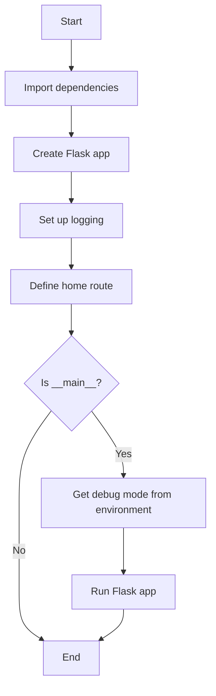
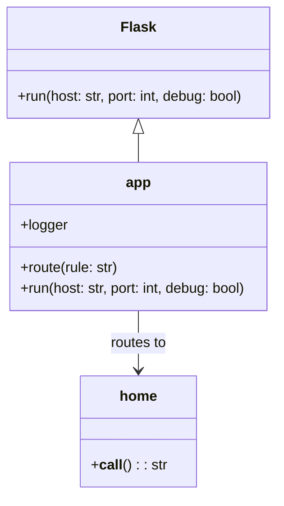
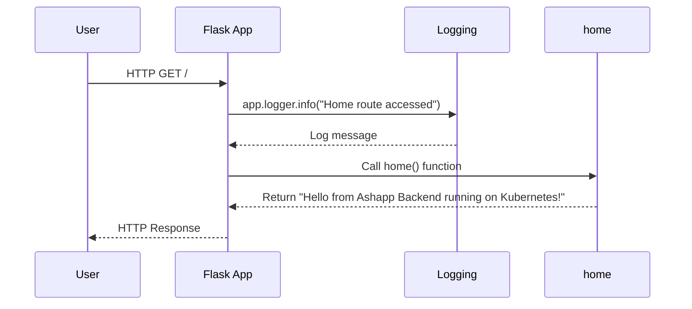

# System Design

Based on the contents of the app.py file, I can generate a simple Mermaid diagram representing the flow of the Flask application. Here's the diagram in markdown fenced code block format:

This diagram represents the following flow from the app.py file:

1. The application starts and imports dependencies.
2. A Flask app is created.
3. Logging is set up.
4. The home route ("/") is defined.
5. The script checks if it's being run as the main program.
6. If it is the main program, it gets the debug mode from the environment variable.
7. The Flask app is run with the specified host, port, and debug settings.
8. If it's not the main program, or after running the app, the script ends.

The diagram shows the basic structure and flow of the Flask application as defined in the app.py file.

# UML Diagrams

Based on the provided app.py file, I can generate a simple class diagram and a sequence diagram for the Flask application. Here are the UML diagrams in Mermaid markdown format:

Class Diagram:

Sequence Diagram:

Explanation:

1. Class Diagram:
   - The `Flask` class is the base class from which `app` inherits.
   - The `app` object is an instance of `Flask` and has methods like `route()` and `run()`.
   - The `home` function is connected to the `app` via routing.

2. Sequence Diagram:
   - Shows the flow when a user accesses the root route ("/").
   - The Flask App receives the request, logs the access, calls the `home()` function, and returns the response to the user.

These diagrams are based on the contents of the app.py file. The application is a simple Flask server with a single route that returns a greeting message. The main functionality includes:

- Setting up a Flask application
- Configuring logging
- Defining a home route
- Running the application with debug mode disabled

The application also uses environment variables to potentially control the debug mode, although it's currently set to False in the `run()` method call.
