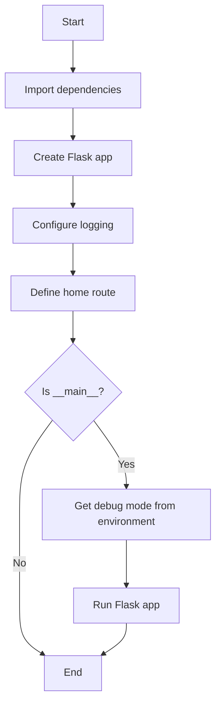
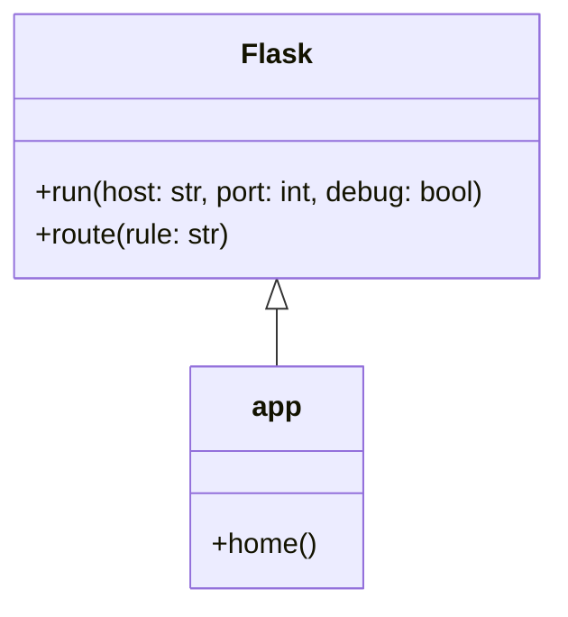
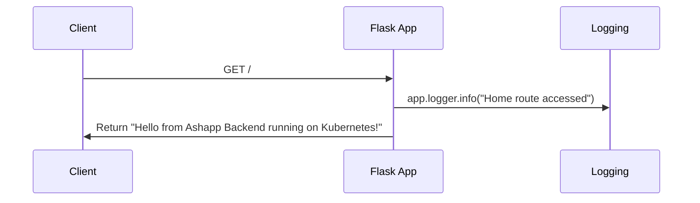

# System Design

Based on the provided `app.py` file, I can generate a simple Mermaid flowchart diagram that represents the basic structure and flow of the Flask application. Here's the diagram in markdown fenced code block format:

This diagram illustrates the following flow from the `app.py` file:

1. The application starts and imports dependencies.
2. A Flask app is created.
3. Logging is configured.
4. The home route is defined.
5. The script checks if it's being run as the main program.
6. If it is the main program, it gets the debug mode from the environment (although it's not used in the final `app.run()` call).
7. The Flask app is run with specific host, port, and debug settings.
8. If it's not the main program, or after running the app, the flow ends.

Note that the diagram shows the general structure, but doesn't include every detail from the file. For example, it doesn't show the specific logging level or the exact content of the home route function. The diagram focuses on the main flow of the application setup and execution.

# UML Diagrams

Based on the provided app.py file, I can generate a simple class diagram and sequence diagram for this Flask application using Mermaid markdown format.

Class Diagram:

Sequence Diagram:

Explanation:

1. Class Diagram:
   - The class diagram shows the relationship between the Flask class and the app instance.
   - The Flask class has methods like run() and route(), which are used in the application.
   - The app class inherits from Flask and has a home() method, which is the route handler.

2. Sequence Diagram:
   - The sequence diagram illustrates the flow when a client accesses the root route ("/").
   - It shows the interaction between the client, the Flask app, and the logging system.
   - The app logs the access and returns the greeting message to the client.

These diagrams are based on the content of the app.py file. The file defines a simple Flask application with a single route ("/") and basic logging. The application is configured to run on host '0.0.0.0', port 5000, with debug mode set to False for production use.
