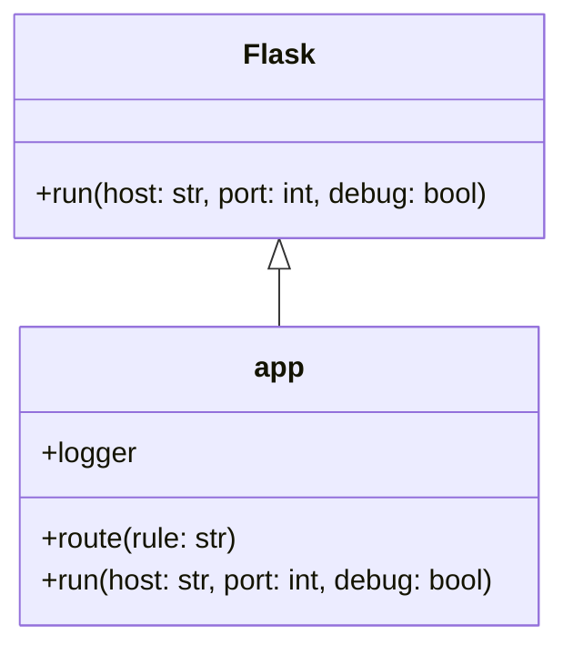
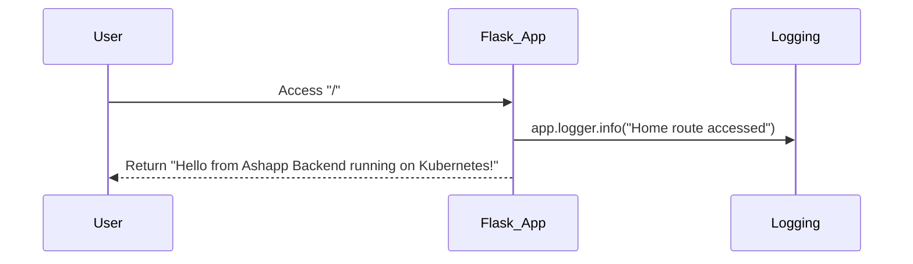

# System Design

Based on the provided `app.py` file, I can generate a simple Mermaid diagram representing the structure and flow of the Flask application. Here's the diagram in markdown fenced code block format:

```mermaid
graph TD
    A[Start] --> B[Import modules]
    B --> C[Create Flask app]
    C --> D[Configure logging]
    D --> E[Define home route]
    E --> F[Main block]
    F --> G[Get debug mode from environment]
    G --> H[Run Flask app]
    H --> I[End]

    E --> J[("/") Home route]
    J --> K[Log access]
    K --> L[Return greeting]
```

This diagram represents the flow of the Flask application defined in `app.py`:

1. The application starts and imports necessary modules.
2. A Flask app is created.
3. Logging is configured.
4. The home route ("/") is defined.
5. In the main block:
   - The debug mode is determined from an environment variable.
   - The Flask app is run with specified host, port, and debug settings.
6. When the home route is accessed:
   - The access is logged.
   - A greeting message is returned.

The diagram shows the basic structure and execution flow of the Flask application as defined in the `app.py` file.

# UML Diagrams

Based on the provided app.py file, I can generate a simple class diagram and a sequence diagram for the application. Here are the UML diagrams in Mermaid markdown format:

Class Diagram:



Sequence Diagram:



Explanation:

1. Class Diagram:
   - The class diagram shows the relationship between the Flask class and the app instance.
   - The app is an instance of Flask, inheriting its methods and properties.
   - The `route` decorator and `run` method are shown as part of the app class.

2. Sequence Diagram:
   - The sequence diagram illustrates the flow when a user accesses the root route ("/").
   - It shows the interaction between the User, Flask_App, and Logging components.
   - When the user accesses the root route, the Flask app logs the access and returns the response.

These diagrams are based on the content of the app.py file. The file shows a simple Flask application with a single route and basic logging configuration. The main functionality is in the home() function, which is called when the root route is accessed.
