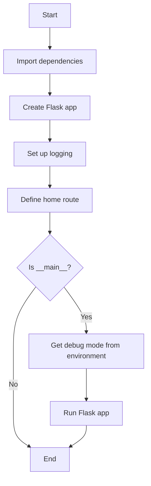
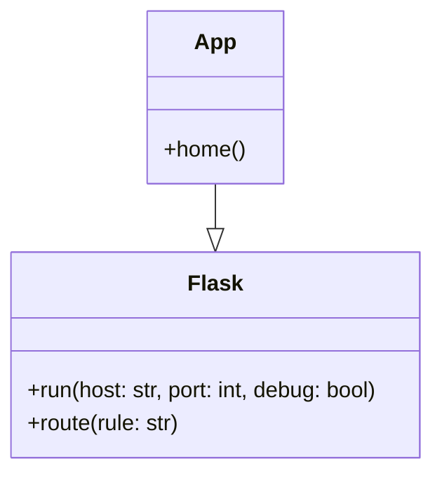
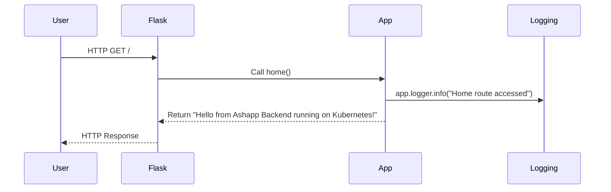

# System Design

Based on the content of app.py, I can create a simple Mermaid diagram that illustrates the basic flow of the application. Here's the diagram in markdown fenced code block format:

This diagram represents the following flow from the app.py file:

1. The application starts and imports dependencies.
2. A Flask app is created.
3. Logging is set up.
4. The home route is defined.
5. The script checks if it's being run as the main program.
6. If it is the main program, it gets the debug mode from the environment (although it's not used in the final run command).
7. The Flask app is run with debug mode set to False.
8. If it's not the main program, or after running the app, the script ends.

The diagram illustrates the basic structure and flow of the Flask application as defined in the app.py file.

# UML Diagrams

Based on the provided app.py file, I can generate a simple class diagram and a sequence diagram for the Flask application. Here are the UML diagrams in Mermaid markdown format:

Class Diagram:

Sequence Diagram:

Explanation:

1. Class Diagram:
   - The diagram shows two classes: Flask and App.
   - App inherits from Flask, as indicated by the app = Flask(__name__) line in the code.
   - Flask has two methods shown: run() and route(), which are used in the application.
   - App has one method: home(), which is the route handler for the root URL.

2. Sequence Diagram:
   - The diagram illustrates the flow of a typical request to the root URL ("/").
   - It shows interactions between the User, Flask framework, App class, and Logging.
   - When a user makes a GET request, Flask routes it to the home() function in the App class.
   - The home() function logs an info message and returns a string response.
   - Flask then sends this response back to the user.

These diagrams are based on the contents of the app.py file, which defines a simple Flask application with a single route and basic logging.
