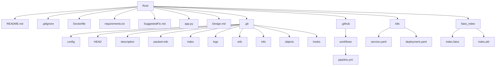

# Repository Design & Architecture

Below is an automatically generated block diagram:

Based on the repo provided, here is a Mermaid diagram representing the repository structure:

This diagram represents the file structure of the repository, including the root directory, main files, and subdirectories. The .git directory is expanded to show its internal structure, and other important directories like .github, k8s, and faiss_index are also represented with their contents.