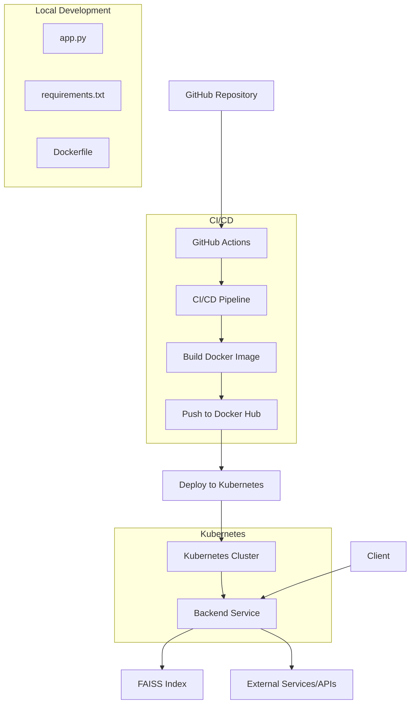

# Repository Design & Architecture

Below is an automatically generated block diagram of the repo workflow:

Based on the repository structure provided, I can create a Mermaid diagram that represents the likely architecture and workflow of this project. Here's my interpretation:

This diagram shows:

1. The GitHub repository as the starting point.
2. GitHub Actions triggering the CI/CD pipeline.
3. The pipeline building a Docker image, pushing it to Docker Hub, and deploying to Kubernetes.
4. A Kubernetes cluster running the backend service.
5. The backend service interacting with a FAISS index (likely for similarity search or recommendation).
6. Clients interacting with the backend service.
7. The backend potentially communicating with external services or APIs.
8. A local development environment with the main application file, requirements, and Dockerfile.

This interpretation is based on the presence of Kubernetes manifests, a Dockerfile, GitHub Actions workflow, and FAISS index files. The actual architecture may vary, but this provides a reasonable approximation based on the available information.