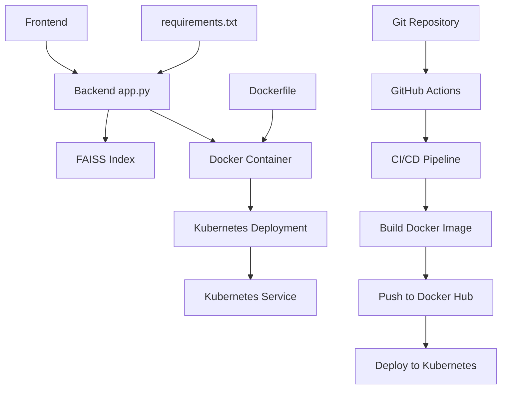

# Repository Design & Architecture

Below is an automatically generated block diagram of the repo workflow:

Based on the repository structure provided, I can create a Mermaid diagram that represents the architecture and workflow of this project. Here's a reasonable interpretation:

This diagram shows:

1. A Frontend component (assumed) that interacts with the Backend (app.py).
2. The Backend uses a FAISS index for some functionality (possibly vector search or similarity matching).
3. The application is containerized using Docker.
4. The Docker container is deployed to Kubernetes.
5. There's a CI/CD pipeline using GitHub Actions that:
   - Builds the Docker image
   - Pushes the image to Docker Hub
   - Deploys the application to Kubernetes
6. The Git repository triggers the GitHub Actions workflow.
7. The requirements.txt file specifies the Python dependencies for the backend.
8. The Dockerfile is used to create the Docker image.

This diagram makes some assumptions based on common practices and the files present in the repository. The actual architecture might differ depending on the specific implementation details not visible in the file structure alone.