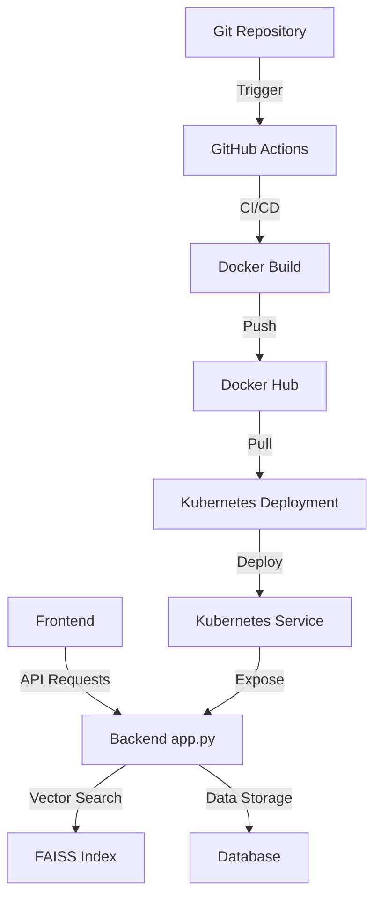

# Repository Design & Architecture

Below is an automatically generated block diagram of the repo workflow:

Based on the repository structure provided, I can create a Mermaid diagram that represents the likely architecture and workflow of this project. Here's my interpretation:

This diagram assumes:

1. There's a frontend component (not explicitly shown in the files) that interacts with the backend.
2. The backend is written in Python (app.py).
3. FAISS is used for vector search (faiss_index folder).
4. There's likely a database, though not explicitly mentioned in the files.
5. GitHub Actions is used for CI/CD (.github/workflows/pipeline.yml).
6. Docker is used for containerization (Dockerfile).
7. The application is deployed to Kubernetes (k8s folder with deployment.yaml and service.yaml).
8. Docker Hub is likely used as the container registry (based on common practices).

This diagram shows the general flow from development (Git repository) through CI/CD, containerization, and deployment, as well as the main components of the running application.