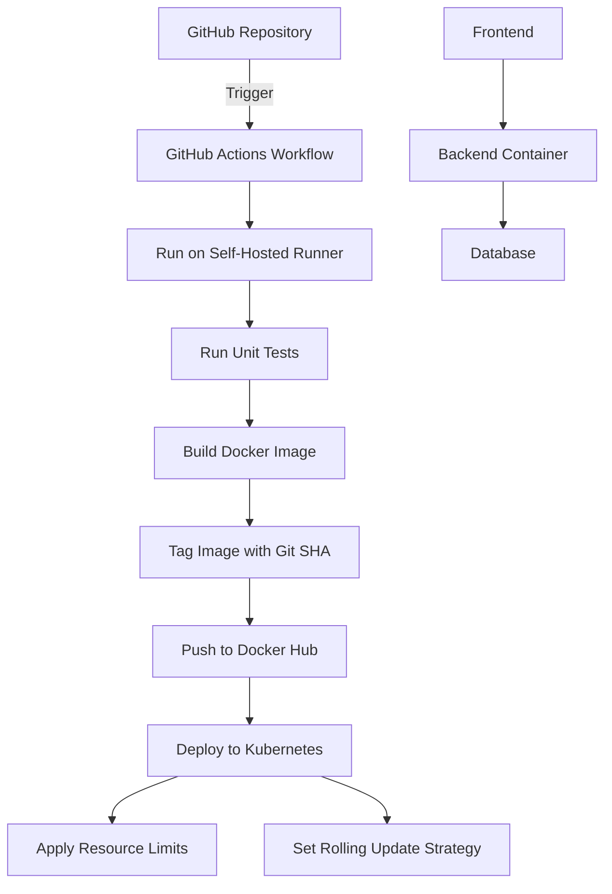

# Repository Design & Architecture

Below is an automatically generated block diagram of the repo workflow:

Based on the context provided, I can create a Mermaid diagram that represents the architecture and workflow of the repository. However, please note that the information is limited, so I'll make some assumptions about the typical components in a CI/CD pipeline. Here's a Mermaid diagram that illustrates the workflow:

This diagram shows the following workflow:

1. The process starts with the GitHub repository.
2. A GitHub Actions workflow is triggered.
3. The workflow runs on a self-hosted runner.
4. Unit tests are run.
5. If tests pass, a Docker image is built.
6. The image is tagged with the Git SHA for versioning.
7. The image is pushed to Docker Hub.
8. The application is deployed to Kubernetes.
9. Resource limits are applied to the container.
10. A rolling update strategy is set for the deployment.

The last three components (Frontend, Backend Container, and Database) represent the typical architecture of the application, although these are assumptions based on common patterns, as the specific details weren't provided in the context.