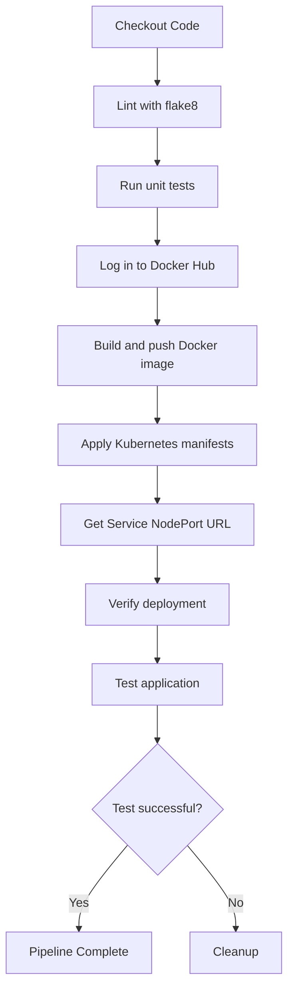

Based on the repository context, I can provide you with a Mermaid diagram representing the CI/CD pipeline workflow as described in the `pipeline.yml` file. Here's the diagram in a markdown fenced code block:

This diagram represents the main steps in the CI/CD pipeline as defined in the `pipeline.yml` file. The workflow includes checking out the code, linting, running unit tests, building and pushing the Docker image, applying Kubernetes manifests, verifying the deployment, and testing the application. It also shows the conditional cleanup step that occurs if the test fails.

[Source: Design.md]
