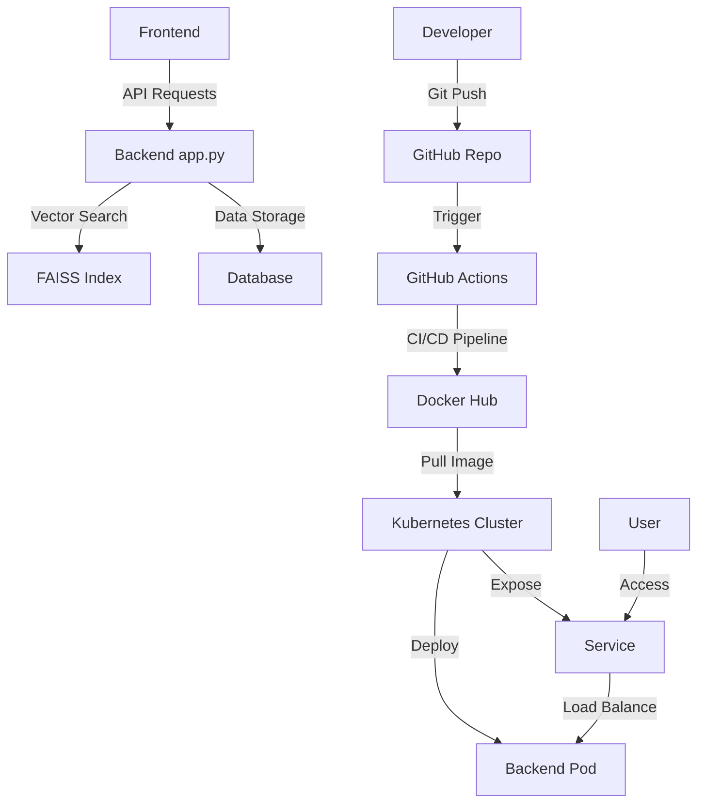

# Repository Design & Architecture

Below is an automatically generated block diagram of the repo workflow:

Based on the repository structure provided, I can create a Mermaid diagram that represents the architecture and workflow of this project. Here's a diagram that makes some reasonable assumptions about the components and their interactions:

This diagram represents the following components and workflows:

1. A Frontend that sends API requests to the Backend (app.py).
2. The Backend (app.py) which interacts with a FAISS index for vector search and a Database for data storage.
3. A GitHub Actions CI/CD pipeline that builds and pushes Docker images to Docker Hub.
4. A Kubernetes cluster that pulls the Docker image and deploys the backend as a pod.
5. A Kubernetes service that exposes and load balances the backend pods.
6. The developer workflow, showing how a Git push triggers the CI/CD pipeline.
7. User access to the application through the Kubernetes service.

This diagram makes some assumptions based on the file structure:
- The presence of a frontend (although not explicitly shown in the files)
- The use of a database (inferred from typical backend architectures)
- The use of FAISS for vector search (based on the faiss_index directory)
- The use of GitHub Actions for CI/CD (based on the .github/workflows/pipeline.yml file)
- Deployment to a Kubernetes cluster (based on the k8s directory with deployment.yaml and service.yaml files)

Please note that this is a simplified representation and the actual architecture may vary depending on the specific implementation details not visible in the file structure alone.