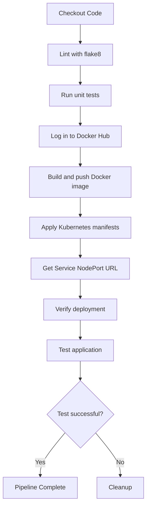

Based on the repository context provided, I can generate a Mermaid diagram that represents the CI/CD pipeline workflow as described in the `pipeline.yml` file. Here's the diagram in a markdown fenced code block:

This diagram represents the main steps in the CI/CD pipeline as defined in the `pipeline.yml` file [Source: pipeline.yml]. The workflow includes:

1. Checking out the code
2. Linting with flake8
3. Running unit tests
4. Logging into Docker Hub
5. Building and pushing the Docker image
6. Applying Kubernetes manifests
7. Getting the Service NodePort URL
8. Verifying the deployment
9. Testing the application
10. Completing the pipeline or cleaning up in case of failure

The diagram shows the logical flow of these steps and the conditional cleanup step that occurs if the test fails.
