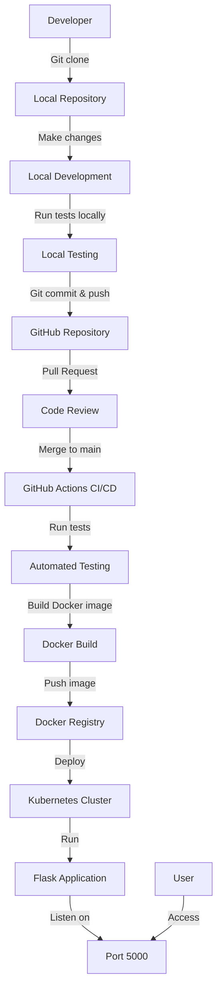

# Repository Design & Architecture

Below is an automatically generated block diagram of the repo workflow:

Certainly! Here's a Mermaid diagram in markdown fenced code block format that shows the architecture and workflow of this repository based on the information provided:

This diagram illustrates the development workflow and architecture of the repository:

1. The developer clones the repository and makes local changes.
2. After local testing, changes are pushed to GitHub.
3. A pull request is created for code review.
4. Once approved and merged, the GitHub Actions CI/CD pipeline is triggered.
5. The pipeline runs tests, builds a Docker image, and pushes it to a registry.
6. The new version is deployed to the Kubernetes cluster.
7. The Flask application runs in the cluster, listening on port 5000.
8. Users can access the application through this port.

This visualization captures the key components and flow of the development, deployment, and runtime processes described in the repository context.