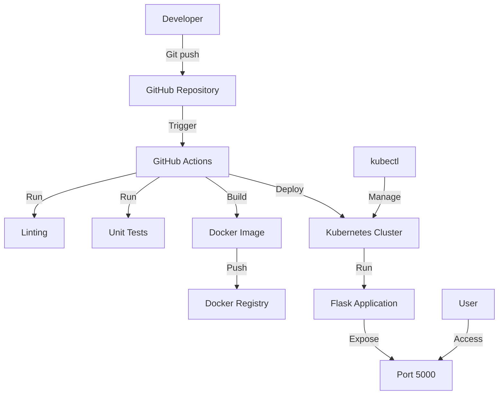

# Repository Design & Architecture

Below is an automatically generated block diagram of the repo workflow:

Here's a Mermaid diagram in markdown fenced code block format that illustrates the architecture and workflow of the repository based on the information provided:

This diagram shows:

1. The developer pushing code to the GitHub repository
2. GitHub Actions being triggered by the push
3. The CI/CD pipeline running linting and unit tests
4. Building a Docker image and pushing it to a registry
5. Deploying the application to a Kubernetes cluster
6. The Flask application running in the cluster and exposed on port 5000
7. Users accessing the application
8. kubectl being used to manage the Kubernetes cluster

Note that this diagram is a simplified representation based on the information provided in the context. It may not capture all details of the actual system but provides a high-level overview of the main components and their interactions.