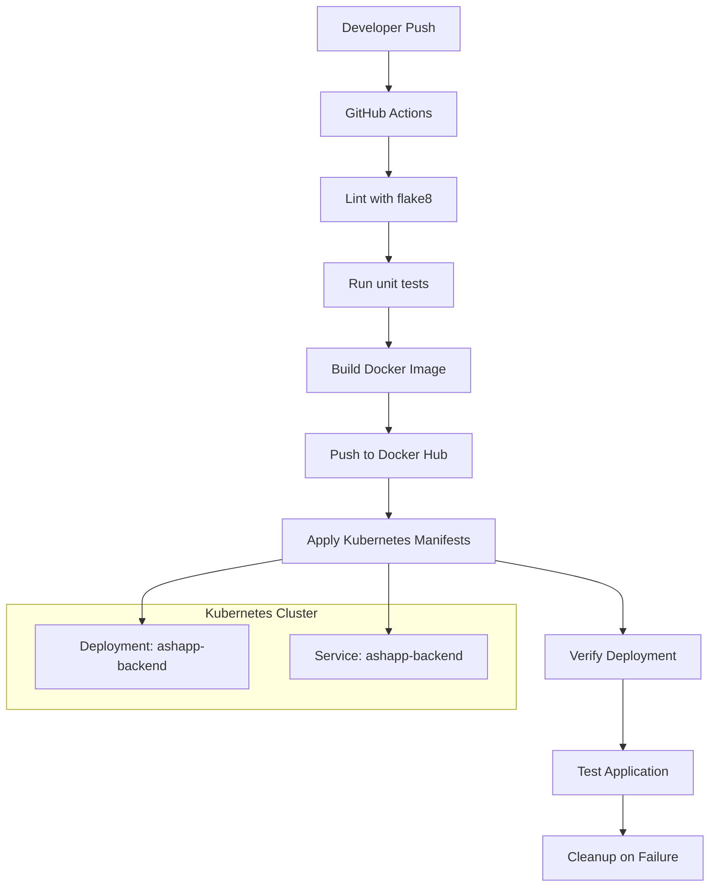

Based on the provided repository context, I can generate a Mermaid diagram that illustrates the CI/CD pipeline and deployment process for the application. Here's a Mermaid diagram in markdown fenced code block format:

This diagram is based on the information from the `pipeline.yml` file, which outlines the CI/CD process, and the `deployment.yaml` file, which describes the Kubernetes deployment. The diagram shows the flow from a developer push to GitHub, through the various steps in the GitHub Actions workflow, and finally to the deployment and verification in the Kubernetes cluster.
