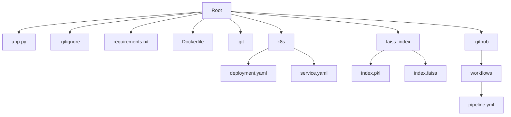

# Repository Design & Architecture

Below is an automatically generated block diagram of the repo workflow:

Based on the repository structure provided, I can generate a Mermaid diagram representing the architecture. However, please note that the actual contents of most files are not provided in the repository context, so this diagram is based solely on the file structure.

This diagram shows the basic structure of the repository, including:

1. The main application file (app.py)
2. Configuration files (.gitignore, requirements.txt, Dockerfile)
3. Git version control directory (.git)
4. Kubernetes configuration directory (k8s) with deployment and service files
5. FAISS index directory (faiss_index) with index files
6. GitHub Actions workflow directory (.github/workflows) with the pipeline configuration

The pipeline.yml file is the only one whose contents are partially visible in the provided context. It appears to be a CI/CD pipeline configuration, but without the full content, I can't provide more detailed information about its specific steps or structure.