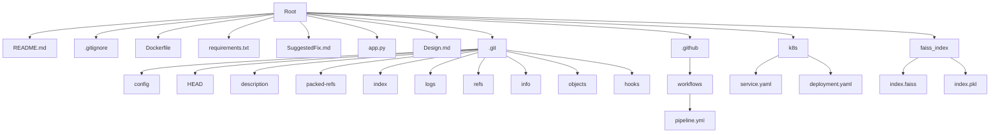

# Repository Design & Architecture

Below is an automatically generated block diagram of the repo workflow:

Based on the repo provided, here is a Mermaid diagram representing the repository structure:

This diagram is generated based on the file structure provided in the repository context. It shows the main directory structure, including the root directory, .git directory, .github directory, k8s directory, and faiss_index directory, along with their respective files and subdirectories.

The diagram is created using the information from the file list in the repository context, which includes all the files and directories mentioned.