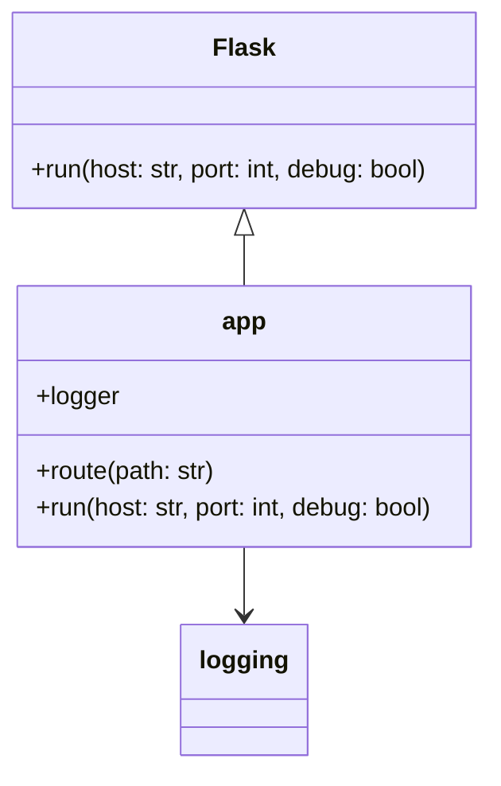
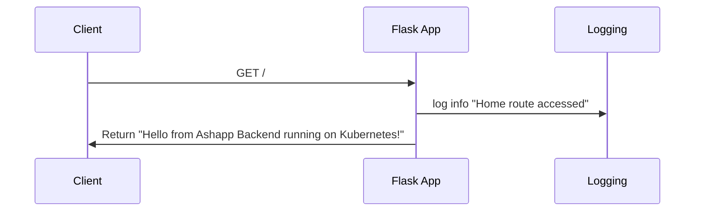

Based on the repository context provided, I can generate basic UML class and sequence diagrams using Mermaid markdown format. These diagrams are derived from the information available in the UML.md file.

Class Diagram:

Sequence Diagram:

These diagrams are inferred from the contents of the app.py file, as mentioned in the UML.md file. The class diagram shows the relationship between the Flask class and the app instance, as well as the connection to the logging module. The sequence diagram illustrates a basic flow of a client making a GET request to the root route, the Flask app logging the access, and then returning a response.

It's important to note that these diagrams are simplified representations based on the limited information available in the repository context. The actual application might be more complex, but without more detailed code, it's not possible to create more comprehensive diagrams.

[Source: UML.md]
