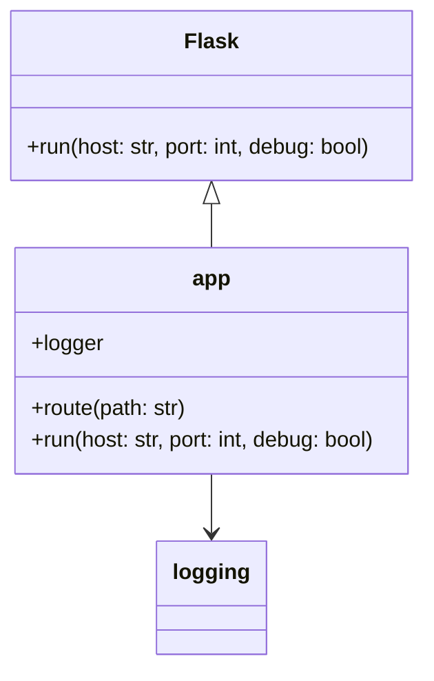
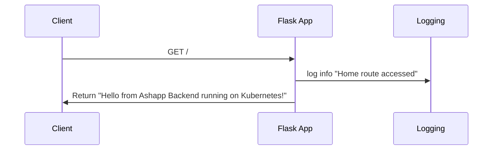

Based on the information provided in the UML.md file, I can provide you with the UML diagrams in Mermaid markdown format. Here are the class and sequence diagrams:

Class Diagram:

Sequence Diagram:

These diagrams are derived from the information available in the UML.md file. The class diagram shows the relationship between the Flask class and the app instance, as well as the connection to the logging module. The sequence diagram illustrates a basic flow of a client making a GET request to the root route, the Flask app logging the access, and then returning a response.

[Source: UML.md]
