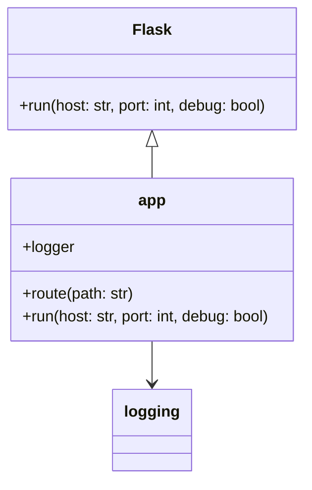
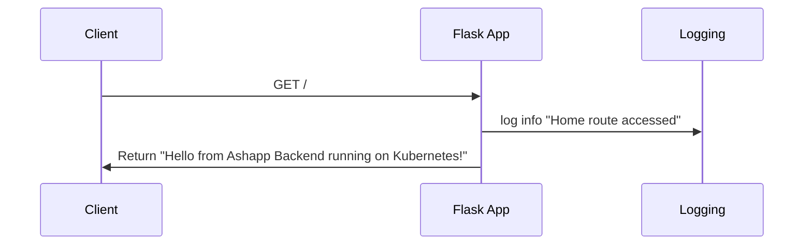

# UML Diagrams

Below are automatically generated UML diagrams in Mermaid format:

Based on the repo provided:

The repository does not contain enough information to generate full UML class and sequence diagrams. However, I can provide a basic class diagram for the main Flask application based on the contents of app.py:

This diagram shows:
- The Flask class, which is imported and used to create the 'app' instance
- The 'app' class, which inherits from Flask and has methods like route() and run()
- A relationship with the logging module, which is used for logging

For a sequence diagram, we can infer a basic flow:

This sequence diagram shows:
- A client making a GET request to the root route (/)
- The Flask app logging the access
- The Flask app returning the response

These diagrams are inferred from the contents of the app.py file. The actual application might be more complex, but without more detailed code, it's not possible to create more comprehensive diagrams.

[Source: app.py]